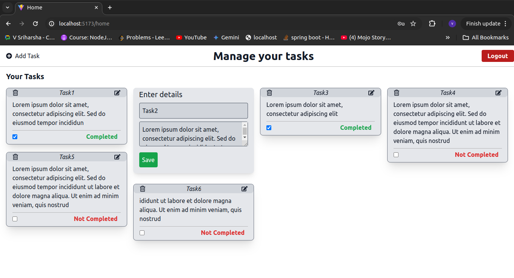

# Task Manager
This project is a MERN stack project that helps a registered user perform CRUD on tasks. While the project does have a React frontend, the focus has been on backend part involving NodeJS, Express, and MongoDB.

## Pre-Requisites
* Docker to run the dockerised application.
* Browser to access the application's frontend.

## Running the application
1. Clone the repository and navigate to the project directory.
    ```
    git clone https://github.com/akhilVogeti/TaskApp

    cd TaskApp
    ```
2. Run the application by using the docker-compose.yml file.
    ```
    docker-compose up
    ```
3. Open browser 
    ```
    localhost:5173
4. Register and then login to use the application.

## APIs

In the backend,

1. Auth
    * ```POST /api/auth/register```: Registers a new user and returns status code 201 on success or 400 with error message. 
    * ```POST /api/auth/login```: Authenticates a user and returns an authentication token.
    
2. Tasks
    * ```GET /api/tasks```: Retrieves a list of all tasks.
    * ```POST /api/tasks```: Creates a new task.
    * ```PUT /api/tasks/:id```: Updates an existing task by ID.
    * ```DELETE /api/tasks/:id```: Deletes a task by ID.

3. The frontend routes are
    * ```http://localhost:5173/```: Landing page.
    * ```http://localhost:5173/register```: Register page.
    * ```http://localhost:5173/login```: Login page.
    * ```http://localhost:5173/home```: Home page with all tasks.


## Output
1. The landing page


2. Register


3. login


4. home after successful login showing all your tasks and a task form to add/update tasks.


5. Click on Edit of any of the tasks in the list to update it.



6. Click on Add Task to add a task. 


## Contribute to the project
To contribute to the project, follow these steps:

1. Fork the repository.
2. Create a new branch.
3. Make your changes.
4. Commit and push your changes.
5. Create a pull request.

## License

Licensed under the MIT license.

